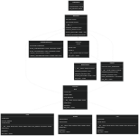

# Orientação a Objetos.

## O que é Programação Orientada a Objetos (POO)?

Programação Orientada a Objetos é um dos paradigmas de programação que representa objetos do mundo real como “objetos” no código. Em vez de pensarmos em termos de funções e procedimentos que executam tarefas isoladas, a POO nos incentiva a modelar entidades com propriedades (atributos) e comportamentos (métodos). Esses objetos podem interagir entre si e, ao longo do desenvolvimento, se tornam a base sobre a qual o software é construído.

Na POO, quatro pilares principais sustentam essa abordagem: Abstração, Encapsulamento, Herança, e Polimorfismo. Além de dois conceitos que não fazem parte oficialmente dos quatro pilares da POO, mas que são extremamente úteis na prática, chamados Composição e Mixins.

### Classes e Objetos

Antes que a gente passe para os conceitos em si e um pequeno exemplo que eu montei, vamos primeiro entender um pouco sobre o conceito de Classes e de Objetos, até porque sem eles, nada que eu fale aqui posteriormente vai fazer algum sentido.

#### Classes:

As Classes em Python ou em qualquer linguagem de programação representam um “molde” ou uma “planta” para a criação de objetos. Imagine que uma classe define as características e comportamentos que um determinado tipo de objeto terá. Por exemplo, se estivermos criando um sistema de biblioteca, poderíamos ter uma classe chamada Livro, que definiria atributos como título, autor, e número de páginas, além de comportamentos como emprestar ou devolver o livro. Uma classe é, portanto, uma abstração que descreve um conjunto de objetos com características e comportamentos em comum.

``` python
class Livro:
  def __init__(self, titulo: str, autor: str, num_paginas: int):
      self.titulo = titulo       # Atributo título
      self.autor = autor         # Atributo autor
      self.num_paginas = num_paginas  # Atributo número de páginas
      self.disponivel = True     # Atributo que indica se o livro está disponível
```

#### Objetos:

Agora, se a classe é o molde, o objeto é a “instância” dessa classe. É a realização concreta daquilo que foi definido pela classe. Quando você cria um objeto, você está basicamente pegando tudo que foi descrito na classe e dando vida a ele, atribuindo valores específicos. Por exemplo, um objeto do tipo Livro seria um livro específico, como “1984” de George Orwell, que tem um autor definido, um número de páginas, e pode ser emprestado ou devolvido. Cada objeto é único, mesmo que tenha sido criado a partir da mesma classe.

``` python
# Criando um objeto do tipo Livro
livro_1984 = Livro("1984", "George Orwell", 328, False) 
# Exibindo as informações do livro 
print(f"Título: {livro_1984.titulo}") # 1984
print(f"Autor: {livro_1984.autor}") # George Orwell
print(f"Número de páginas: {livro_1984.num_paginas} páginas") # 328 páginas
print(f"Disponível: {livro_1984.disponivel}") # False
```

TLDR: a classe é uma planta geral de algo, e o objeto é a sua concretização.

#### Abstração

A abstração consiste em ocultar os detalhes complexos de implementação e mostrar apenas a funcionalidade essencial. Em vez de expor a implementação interna de um objeto, a abstração oferece uma visão simplificada para quem utiliza o objeto. No código, isso é feito através de classes abstratas, onde métodos são declarados, mas não implementados.

No código, a classe Item é um exemplo de abstração. Ela define métodos abstratos como emprestar, devolver e get_info, que precisam ser implementados nas subclasses (Livro, Revista, DVD).


``` python
class Item(ABC):
  @abstractmethod
  def emprestar(self) -> None:
      pass
  
  @abstractmethod
  def devolver(self) -> None:
      pass
  
  @abstractmethod
  def get_info(self) -> str:
      pass
```

#### Encapsulamento

Encapsulamento é o princípio de esconder os detalhes internos de um objeto e proteger seus dados de acessos externos diretos. Isso é feito através de métodos públicos que controlam como os atributos são manipulados. Dessa forma, o estado interno do objeto é protegido contra modificações não intencionais.

No código, o encapsulamento é evidente na classe SistemaNotificacao, onde métodos como _enviar_email e _enviar_sms são privados (indicados pelo _), e a notificação é feita através de métodos públicos como notificar_atraso.

``` python
class SistemaNotificacao:
  def _enviar_email(self, destinatario: str, mensagem: str) -> None:
      print(f"Email enviado para {destinatario}: {mensagem}")
  
  def notificar_atraso(self, usuario: Usuario) -> None:
      mensagem = f"Olá {usuario._nome}, você tem itens em atraso!"
      self._enviar_email(usuario._nome, mensagem)
```

#### Herança

A herança permite que uma classe (subclasse) herde atributos e métodos de outra classe (superclasse), promovendo a reutilização de código. Isso possibilita que as subclasses implementem funcionalidades adicionais ou modifiquem o comportamento herdado.

No exemplo, Livro, Revista, e DVD herdam de Item, o que permite que essas subclasses compartilhem características comuns e implementem seus próprios métodos de emprestar e devolver.

``` python
class Livro(Item):
  def emprestar(self) -> None:
      self.disponivel = False
  
  def devolver(self) -> None:
      self.disponivel = True
```

#### Polimorfismo

Polimorfismo significa que diferentes classes podem ser tratadas como a mesma interface ou tipo comum, permitindo que objetos de diferentes classes respondam a métodos da mesma forma. O método que será executado depende do tipo do objeto que está chamando a função.

O método listar_emprestimos na classe Usuario usa polimorfismo para tratar diferentes tipos de Item (seja Livro, Revista ou DVD) da mesma maneira, chamando o método get_info, que é implementado de forma diferente em cada uma das subclasses.

``` python
def listar_emprestimos(self) -> List[str]:
  return [item.get_info() for item in self.itens_emprestados]
```

#### Composição

Composição é quando um objeto contém ou é composto por outros objetos. Em vez de herdar, uma classe pode ter instâncias de outras classes como atributos, promovendo a reutilização de código e a criação de componentes modulares.

A classe Biblioteca é um exemplo de composição, pois contém instâncias de Item e Pessoa dentro de suas listas internas _acervo e _pessoas. Ela também contém o objeto SistemaNotificacao para gerenciar notificações.

``` python
class Biblioteca(LoggerMixin):
  def __init__(self):
      self._acervo: List[Item] = []
      self._pessoas: List[Pessoa] = []
      self._sistema_notificacao = SistemaNotificacao()
```

#### Mixins

Mixins são classes que fornecem funcionalidades específicas para serem adicionadas a outras classes através de herança, sem a necessidade de herdar uma classe principal. Eles são utilizados para adicionar comportamentos sem modificar a hierarquia de classes.

O LoggerMixin adiciona a capacidade de log à classe Biblioteca, permitindo que a biblioteca registre eventos como a adição de itens. Através do mixin, a classe Biblioteca não precisa implementar essa funcionalidade diretamente.

``` python
class LoggerMixin:
  def log(self, mensagem: str) -> None:
      print(f"[LOG] {datetime.now()}: {mensagem}")

class Biblioteca(LoggerMixin):
  def adicionar_item(self, item: Item) -> None:
      self._acervo.append(item)
      self.log(f"Item adicionado: {item.get_info()}")
```

#### Para ficar um pouco melhor de visualizar

Por fim, eu fiz um modelo UML para facilitar a visualização da estrutura geral da Biblioteca que criamos e ver que, de fato, conseguimos transformar uma estrutura tangível em código com muito mais facilidade quando levamos isso para a Orientação a Objetos.



